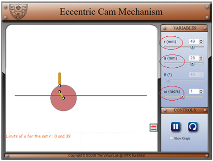
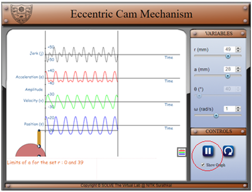
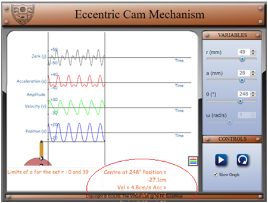

1. The simulation of eccentric cam is developed using JavaScript and HTML.
2. The simulation initially begins with the default set of parameters which can be changed by adjusting the scroll of respective parameter as shown below.

3. For starting a simulation, select appropriate parameters for the simulation and click on the play.

4. To view the graphs, click on show graph.
5. Stopping the simulation after some time will give the position, velocity, acceleration and jerk at that instant.

